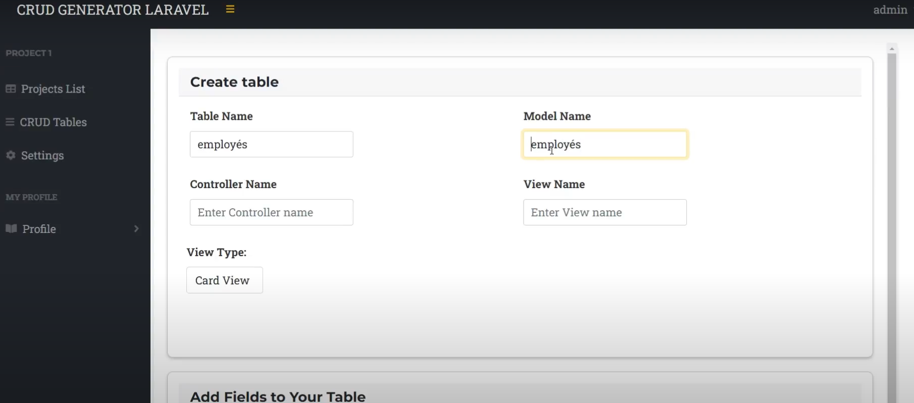

<p align="center">
<a href="https://laravel.com" target="_blank">

</a>
</p>

# CRUD Operations Generator (Laravel)

## Overview

This repository contains the code for a CRUD operations generator built using Laravel as part of an end-of-study project during my internship at **Enterprise eSolutions**. The project aimed to develop a platform that allows developers to easily generate and manage database operations (Create, Read, Update, Delete) through a streamlined interface.

The platform simplifies the process of managing database entities and is designed to save developers time by automating repetitive tasks associated with CRUD operations.

## Features

- **User-Friendly Interface**: The platform offers an intuitive interface, allowing developers to generate and manage database operations efficiently.
- **Dynamic Code Generation**: Easily generate CRUD operations for different database tables and customize forms, validation, and routes automatically.
- **Efficient Data Management**: Provides tools for managing large datasets with pagination, search, and filtering functionality.
- **Responsive Design**: The platform is mobile-friendly and built to work across various devices and screen sizes.
- **Built with Laravel**: Utilizing the powerful Laravel framework, the project ensures maintainability, security, and ease of integration with other systems.

## Technologies Used

- **Backend**: Laravel 9.x, PHP 8.x
- **Frontend**: Blade templating engine, Bootstrap 5
- **Database**: MySQL
- **Version Control**: Git, GitHub

## Installation

1. Clone the repository:
   ```bash
   git clone https://github.com/your-username/crud-operations-generator.git
2. Navigate to the project directory:
   ```bash
   cd crud-operations-generator
3. Install dependencies using Composer:
    ```bash
    composer install
4. Create a .env file by copying .env.example:
   ```bash
   cp .env.example .env

5. Generate an application key:
   ```bash
    php artisan key:generate
6. Set up your database in the .env file:
    ```bash
     DB_DATABASE=your_database_name
     DB_USERNAME=your_database_user
     DB_PASSWORD=your_database_password
7. Run the migrations to set up database tables:
     ```bash
     php artisan migrate
7. Serve the application locally:
     ```bash
      php artisan serve

## Usage
Once installed and running, navigate to http://localhost:8000 to access the CRUD operations generator. The platform will guide you through creating and managing database tables, generating forms, and handling data validation.

## Screenshots





## Contributing
Contributions are welcome! If you would like to contribute, please fork the repository and submit a pull request. Feel free to open issues if you encounter any problems.

## License
This project is open-sourced software licensed under the MIT license.


